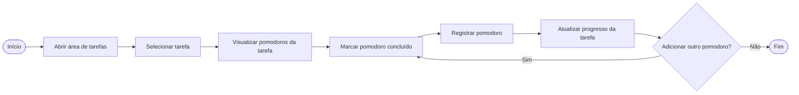

### Cadastro Manual de Pomodoros em uma Tarefa

```mermaid
flowchart LR
    Inicio([Início]) --> AbrirTarefas[Abrir área de tarefas]
    AbrirTarefas --> SelecionarTarefa[Selecionar tarefa]

    SelecionarTarefa --> VisualizarPomodoros[Visualizar pomodoros da tarefa]

    VisualizarPomodoros --> AdicionarPomodoro[Marcar pomodoro concluído]
    AdicionarPomodoro --> RegistrarSessao[Registrar pomodoro]

    RegistrarSessao --> AtualizarProgresso[Atualizar progresso da tarefa]

    AtualizarProgresso --> OutroPomodoro{Adicionar outro pomodoro?}
    OutroPomodoro -- Sim --> AdicionarPomodoro
    OutroPomodoro -- Não --> Fim([Fim])

```