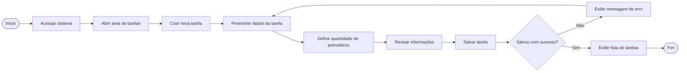

### Registro de tarefas com pomodoros

```mermaid
flowchart LR
    Inicio([Início]) --> AcessarSistema[Acessar sistema]
    AcessarSistema --> AbrirTarefas[Abrir área de tarefas]

    AbrirTarefas --> NovaTarefa[Criar nova tarefa]
    NovaTarefa --> PreencherDados[Preencher dados da tarefa]

    PreencherDados --> DefinirPomodoros[Definir quantidade de pomodoros]
    DefinirPomodoros --> RevisarTarefa[Revisar informações]

    RevisarTarefa --> SalvarTarefa[Salvar tarefa]

    SalvarTarefa --> Salvo{Salvou com sucesso?}
    Salvo -- Não --> Erro[Exibir mensagem de erro]
    Erro --> PreencherDados

    Salvo -- Sim --> ListaTarefas[Exibir lista de tarefas]
    ListaTarefas --> Fim([Fim])
```