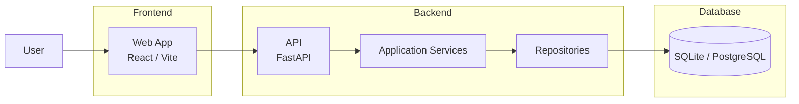

### Arquitetura do PomoPlanner (C4 – Container)

```mermaid
flowchart LR
    User[User]

    subgraph Frontend
        FE[Web App<br/>React / Vite]
    end

    subgraph Backend
        API[API<br/>FastAPI]
        Service[Application Services]
        Repo[Repositories]
    end

    subgraph Database
        DB[(SQLite / PostgreSQL)]
    end

    User --> FE
    FE --> API
    API --> Service
    Service --> Repo
    Repo --> DB
```