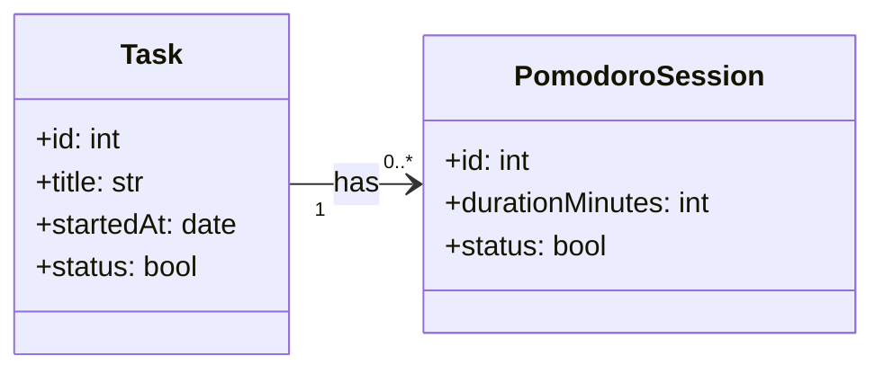

### Diagrama de classes

```mermaid
classDiagram
    direction LR

    class Task {
        +id: int
        +title: str
        +startedAt: date
        +status: bool
    }

    class PomodoroSession {
        +id: int
        +durationMinutes: int
        +status: bool
    }

    Task "1" --> "0..*" PomodoroSession : has
```